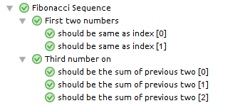

Jasmine-Parameterized
=====================

Parameterized unit tests for Jasmine.

## Examples

### Single param per case
```
describe('Customer', () => {

    cases([
        4,
        14
    ])
    .it('should be a child when aged 4 to 14 years', (age) => {
        const customer = new Customer(age);
        expect(customer.isChild()).toBe(true);
    });
...
```


### Multiple params per case
```
describe('Fibonacci Sequence', () => {

    describe('First two numbers', () => {
        cases([
            {index: 0, expected: 0},
            {index: 1, expected: 1}
        ])
        .it('should be same as index', ({index, expected}) => {
            expect(fibonacciNumber(index)).toEqual(expected);
        });
    });

    describe('Third number on', () => {
        cases([
            {index: 2, expected: 1},
            {index: 3, expected: 2},
            {index: 5, expected: 5}
        ])
        .it('should be the sum of previous two', ({index, expected}) => {
            expect(fibonacciNumber(index)).toEqual(expected);
        });
    });

});
```


